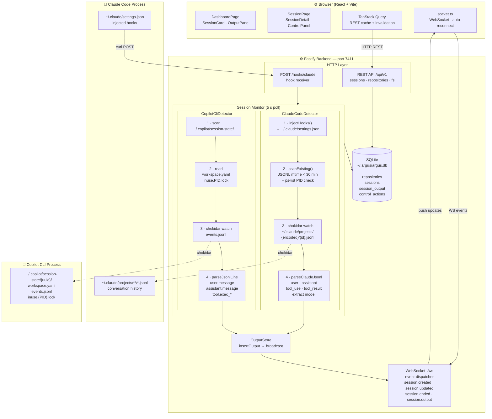

# Argus — Architecture

Argus is a local dashboard that gives you centralized visibility and remote control over Claude Code and GitHub Copilot CLI sessions running on your machine. It runs a Fastify backend (Node/TypeScript) that watches AI tool files on disk and injects hooks, stores everything in SQLite, and streams updates to a React frontend over WebSockets.

## Key Design Decisions

- **No agents/APIs** — detection is purely file-system based (no Copilot API calls, no Claude API calls)
- **Claude Code hooks** are injected into `~/.claude/settings.json` to receive push events; Copilot is detected passively via file watching
- **WebSocket push** keeps the UI live; TanStack Query handles caching and cache invalidation on WS events
- **SQLite** stores full session history with configurable retention via `pruning-job.ts`

## Development Tooling

All feature work follows a Speckit specification-driven pipeline (`specify → clarify → plan → tasks → analyze → implement`). See `CLAUDE.md` for the full workflow — it is the single source of truth for both Claude Code and the GitHub Copilot CLI.

Speckit skill definitions live in `.claude/commands/`. The CI pipeline (`.github/workflows/ci.yml`) enforces lockfile integrity, action SHA pinning, and critical CVE auditing on every push.
