# Argus

Your command center for Claude Code and GitHub Copilot CLI sessions. Watch every session live, send commands, and stop runaway agents, all from a single browser tab.

## Links

- **Landing Page**: [aarthi-ntrjn.github.io/argus](https://aarthi-ntrjn.github.io/argus)
- **npm**: [npmjs.com/package/argus-ai-hub](https://www.npmjs.com/package/argus-ai-hub)
- **GitHub**: [aarthi-ntrjn/argus](https://github.com/aarthi-ntrjn/argus)
- **Contributor docs**: [docs/README-CONTRIBUTORS.md](docs/README-CONTRIBUTORS.md)

## Requirements

- Node.js 22 LTS
- GitHub Copilot CLI and/or Claude Code installed

## Getting Started

Run with npx (no install required):

```sh
npx argus-ai-hub
```

Or install globally so `argus` is always on your path:

```sh
npm install -g argus-ai-hub
argus
```

Open **http://localhost:7411** and you're in. The port is configurable in [`~/.argus/config.json`](#storage).

## Monitor

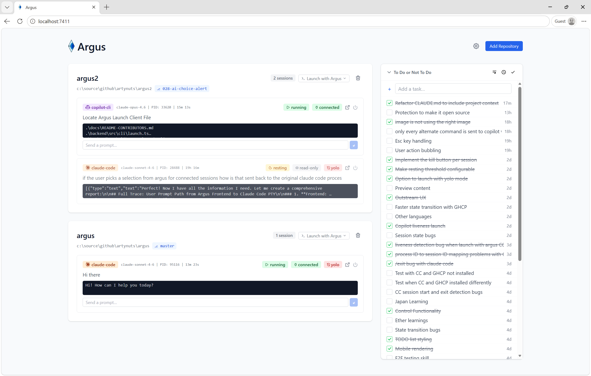

See everything happening across your AI sessions without switching terminals.

### Session Cards

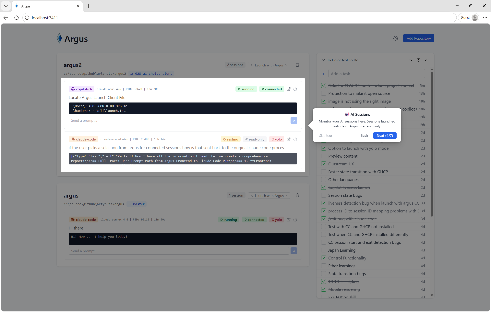

Each card is a live snapshot of a session:

- **CLI badge** (copilot-cli / claude-code) Argus currently support GitHub Copilot CLI and Claude Code CLI
- **status badge** (running / resting / ended) Running - for conversations that have had activity within the configured resting threshold (default: 20 minutes), resting for conversations that have had no activity beyond the threshold, Ended for conversations that have exited.
- **session type** (readonly / live) readonly - for conversation that were started outside of Argus, these sessions can be monitored only, they cannot be controlled from Argus. live - for conversations that were started from Argus using _Lauch with Argus_, these sessions can be monitored and controlled from Argus using the send prompt input
- **Model** in small monospace text when known (e.g. `claude-opus-4-5`)
- **PID** when known. For Claude Code sessions without a detected PID, a **session ID prefix** is shown instead (e.g. `ID: abc12345`)
- **Elapsed time** representing how long since the session start
- **Drill in link**: displays a larger view of the session.
- **Current prompt**: the most recent question you asked, shown below the badges and updated live as the conversation progresses
- **Last output preview**: up to 2 lines of the most recent AI reply
- **Send prompt input and button**: (only in live sessions) Type a prompt and send to the CLI session from Argus.
- **Focus button** (crosshair icon): brings the originating terminal window to the foreground. Shown for all active sessions; disabled when no PID is known.

### Session Output

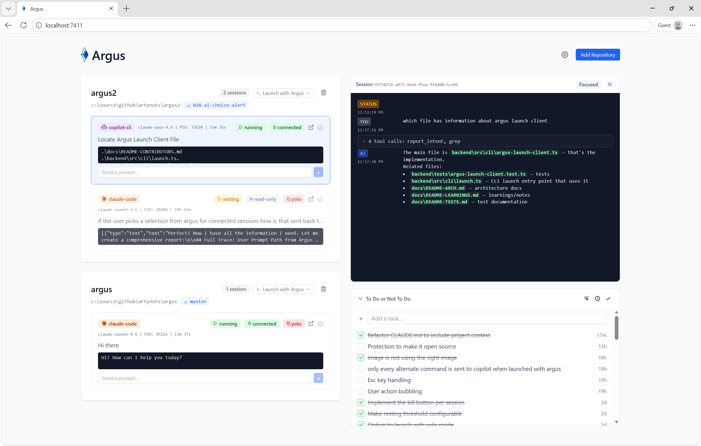

Click any card to open a **live output pane** on the right inline. The card list stays visible on the left. Click another card to switch sessions. The selected session is persisted across page refreshes. Click the **X** icon in the output pane header to close it.

Output lines carry type badges so you always know what's what: **YOU** (your input), **AI** (assistant reply), **TOOL** (tool call), **RESULT** (tool result), **STATUS** (status change), **ERR** (error). These are streamed in real time, including tool calls.

#### Focused and Verbose Mode

The output pane has two display modes, toggled via the **Focused / Verbose** button in the pane header:

- **Focused** (default): hides noisy tool results. Tool calls show a compact one-line summary. Click **show result** on any row to expand it inline. Your messages, AI replies, status changes, and errors are always visible.

  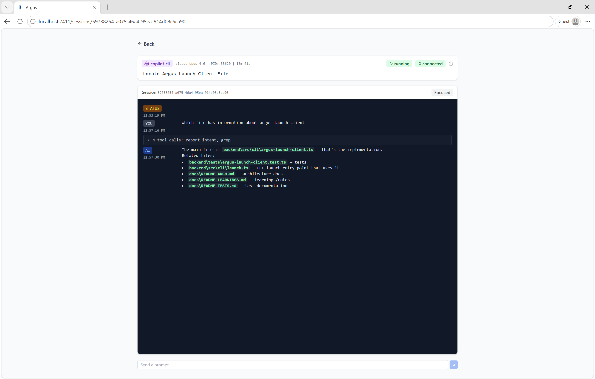

- **Verbose**: shows everything. Long tool results (over 40 lines) are truncated with a **show more** button. Tool calls show their full content.

  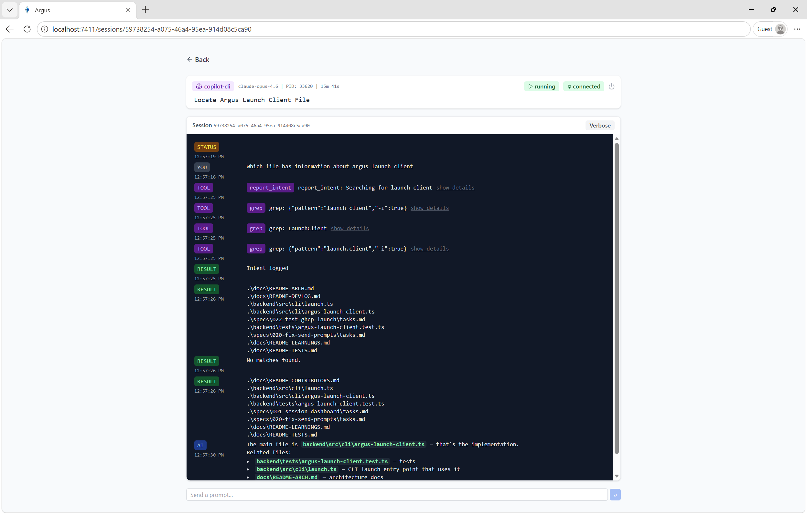

The selected mode persists across sessions and page reloads.

### Session Detection

Argus detects sessions using two sources:

- **Claude Code**: Reads `~/.claude/sessions/{PID}.json` files that Claude maintains. Each file maps a process ID to a session ID and working directory. This gives Argus a deterministic PID-to-session mapping that works with any number of concurrent sessions, even in the same repo. Sessions launched via `argus launch` get their PID from the PTY registry instead.
- **Copilot CLI**: Reads `inuse.{PID}.lock` files in `~/.copilot/session-state/{sessionId}/`. Each session directory also contains a `workspace.yaml` with the session ID, working directory, and timestamps.

In both cases, Argus checks every 5 seconds whether the session's PID is still running. If the process has exited, the session is marked **ended**. If a session has no PID yet (e.g., the registry file hasn't appeared), Argus monitors JSONL file freshness to detect activity.
The frontend shows a **resting** badge when there has been no output beyond the configured resting threshold (default: 20 minutes) but the process is still running. The threshold is configurable in Settings.

## Control

Take charge of any session without touching the terminal.

### Killing a Session

Every session card and the session detail page have a **kill button** (■ icon) next to the session badges. It appears for sessions that have a known PID and are still running (not ended or completed).

1. Click the kill button on any active session card or on the session detail page header.
2. A confirmation dialog appears showing the session type and ID prefix.
3. Click **Kill Session** to terminate the process, or **Cancel** to dismiss.
4. If the kill fails (session already ended, not found, or a network error), the error message is shown in the dialog so you can retry or dismiss.

### Focusing a Terminal Window

Each active session card has a **Focus** button (crosshair icon) next to the kill button. Clicking it brings the originating CLI terminal window to the foreground so you can type directly without hunting for the window.

The button is shown for all active sessions and is disabled (greyed out) when Argus has no PID on record for that session. It works on Windows (SetForegroundWindow), macOS (osascript), and Linux (wmctrl or xdotool).

### Starting a Session with Prompt Control

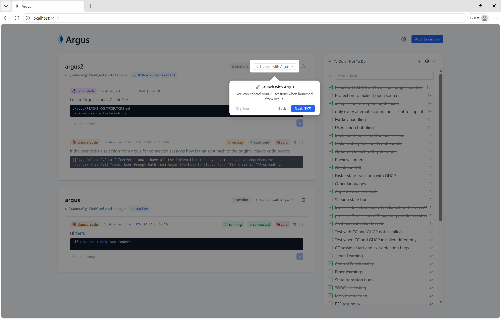

To send prompts to a session, start it through Argus.This gives Argus a direct PTY write channel to the process.

The easiest way is to click the **Launch with Argus** dropdown in any repo card header and select **Launch Claude** or **Launch Copilot**.

#### Headless Environments (Codespaces, SSH, no TTY)

When Argus detects it is running in a headless environment (no interactive terminal available, such as GitHub Codespaces or a remote SSH session), the launch dropdown switches to copy mode. Each row shows a **copy icon** and clicking anywhere on the row copies the launch command to your clipboard. A note at the bottom of the menu reads "No terminal available. Copy and run manually." Paste the copied command into your own terminal to start the session.

Sessions detected automatically (not started via `argus launch`) show a **read-only** badge. Their prompt bars are not visible. Use the **Kill Session** button to terminate any session with a known PID.

### ATTENTION NEEDED Alert

When an AI session is waiting for user input, the session card summary line changes to a bold red **ATTENTION NEEDED** indicator.

The alert shows:
- The question the AI asked (e.g., "Which option?")
- Numbered choices when available (e.g., "1. Alpha / 2. Beta")

The alert appears for both read-only and connected sessions. It is never shown for sessions with status `ended` or `completed`.

**Detection methods by session type:**

- **Claude Code sessions**: Argus uses a `PreToolUse` hook (auto-configured in `~/.claude/settings.json`) that fires the moment Claude calls `AskUserQuestion`, before the interactive menu is shown. This gives real-time detection independent of JSONL file updates. When the user answers, a `PostToolUse` hook clears the alert immediately. Argus manages these hook entries automatically alongside the existing `SessionStart` and `SessionEnd` hooks.

- **GitHub Copilot sessions**: Detection is based on output stream parsing. When a `ask_user` tool_use appears in the session output without a subsequent `tool_result`, the alert is shown. It disappears once the `tool_result` (the user's answer) is written to the output.

### Prompt Bar

Every session card has a prompt bar. For **live** (PTY-launched) sessions, type a message and press **↵** to send it.

Prompt injection works for both Claude Code and Copilot CLI when started via `Launch with Argus`.

### Repository Management

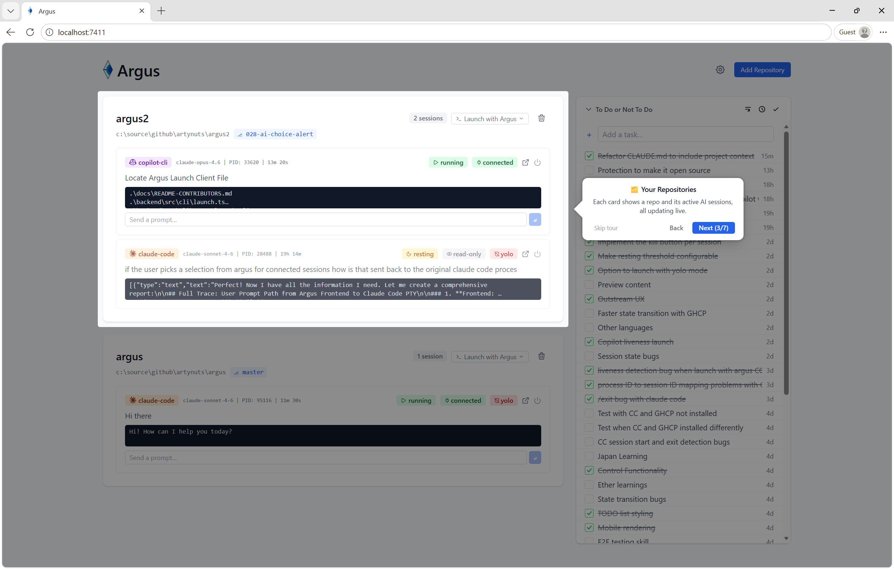

Click **Add Repository**, type or paste a root folder path (e.g. `C:\source` or `/home/user/projects`), then click **Scan &amp; Add**.

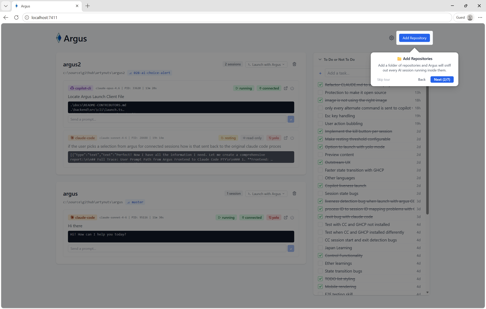

Argus scans that folder recursively for git repos and registers all new ones in one go. Already-registered repos are skipped automatically.

Paths are normalized on entry: trailing slashes and mixed separators are stripped, and spaces in paths (common on Linux) are handled correctly. Both the path you type and the working directory reported by Claude/Copilot are normalized the same way, so sessions always match their registered repo.

Each repo card shows the current branch name and, when the remote is a GitHub repository, a **compare link icon** (external link) next to the branch badge. Clicking it opens the GitHub compare page for that branch against master in a new tab. On the default branch (master or main), the link opens the repository's compare page directly.

## To Tackle

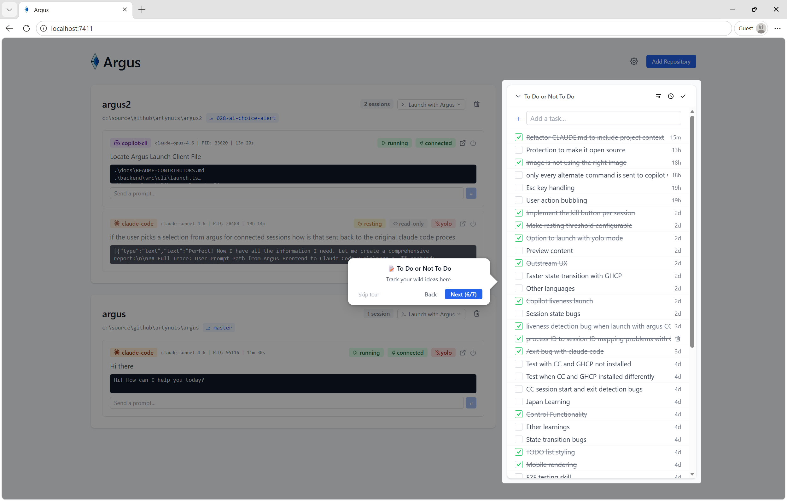

The **To Tackle** panel lives on the right side of the dashboard.Use it to jot down tasks, reminders, or notes essentially your brain dump.

- Add items with the input at the top, press **Enter** to save
- Check off completed items; toggle visibility of done items with the button in the header
- Delete items with the trash icon that appears on hover
- Toggle timestamps on/off to see when each item was added
- Items are stored in the local database and survive page refreshes

## Mobile Browser Support

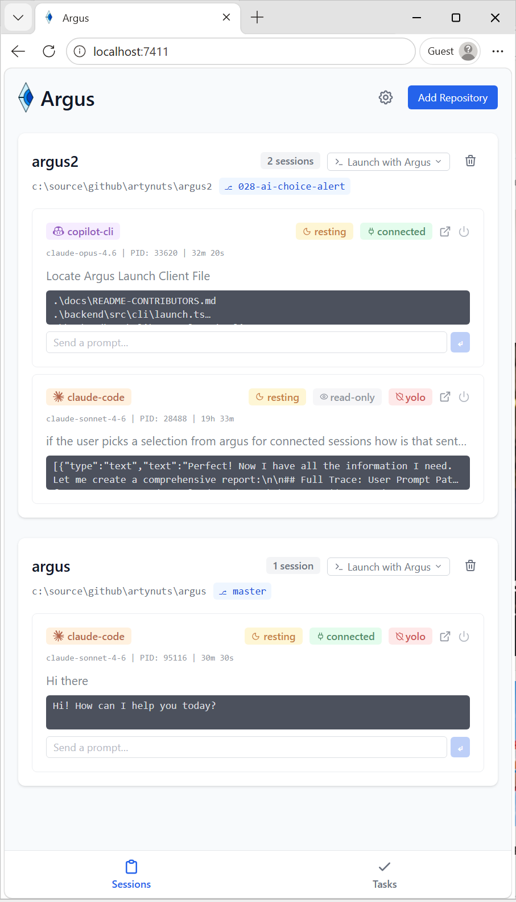

Argus is fully usablewhen you remote into your machine from mobile devices (390px and up). On narrow viewports:

- Sessions and Tasks views are accessible via a **bottom tab bar** (Sessions / Tasks).
- Tapping a session card opens the full **session detail page** instead of the inline output pane.
- The layout reflows automatically when the browser is resized across the 768px breakpoint.

Desktop layout (two-column with inline output pane) is unchanged.

## Dashboard Settings

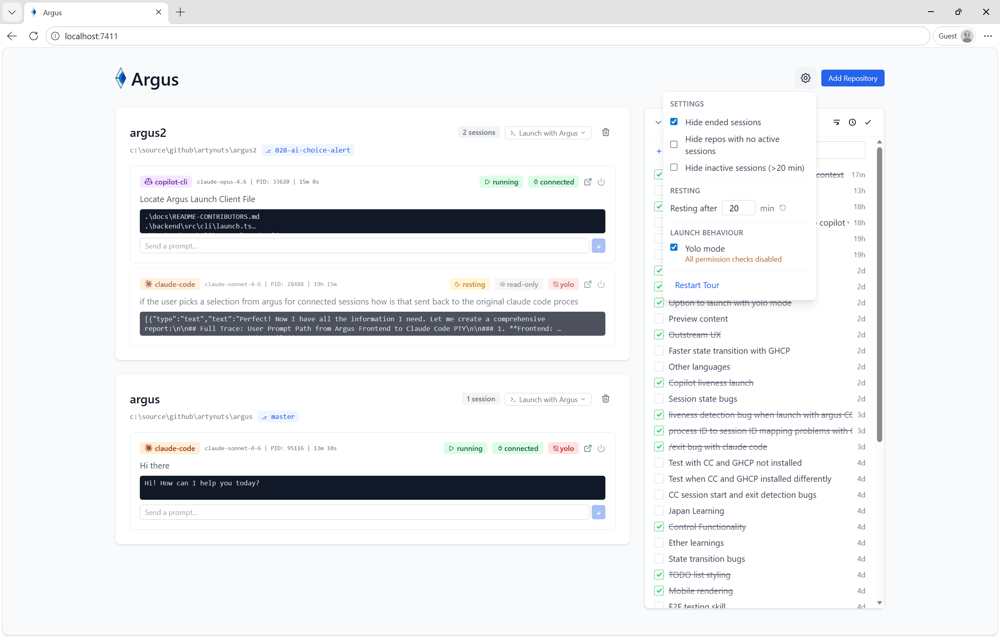

Click the **gear icon** (top-right) to open Settings.

| Setting                            | Default  | Description                                                                        |
| ---------------------------------- | -------- | ---------------------------------------------------------------------------------- |
| Hide ended sessions                | On       | Hides sessions with status `completed` or `ended`                                  |
| Hide repos with no active sessions | Off      | Hides repo cards that have no sessions with status `active`, `waiting`, or `error` |
| Hide inactive sessions             | Off      | Hides sessions with no output in the last N minutes (see Resting threshold below)  |
| Hide To Do panel                   | Off      | Removes the To Do panel from the dashboard entirely                                 |
| Resting after (minutes)            | 20       | Minutes of inactivity before a session is shown as **resting**. Valid range: 1 to 60. Click **Reset** to restore the default. |

These settings are saved in your browser (`localStorage`) and restored on every load.

### Rescan Remote URLs

The **Rescan Remote URLs** button (in the Settings panel) re-runs `git remote get-url origin` for every registered repository and updates any that have changed. Use this if you moved a repo to a different remote, renamed the GitHub repo, or added a remote after the repo was already registered. Only changed repos are updated; the compare link in each repo card refreshes automatically via the live WebSocket connection.

### Launch Behaviour: Yolo Mode

| Setting    | Default | Description                                                                             |
| ---------- | ------- | --------------------------------------------------------------------------------------- |
| Yolo mode  | Off     | Launches all sessions with all permission checks and safety prompts disabled            |

When **Yolo mode** is enabled, a warning dialog is shown. After confirmation:

- **Claude Code** sessions are launched with `--dangerously-skip-permissions`
- **Copilot CLI** sessions are launched with `--allow-all`

This applies to both sessions launched directly from the Argus UI and commands copied to clipboard. The setting is stored in `~/.argus/config.json` and persists across restarts.

To disable, toggle Yolo mode off in Settings. No confirmation is required to disable.

## Onboarding

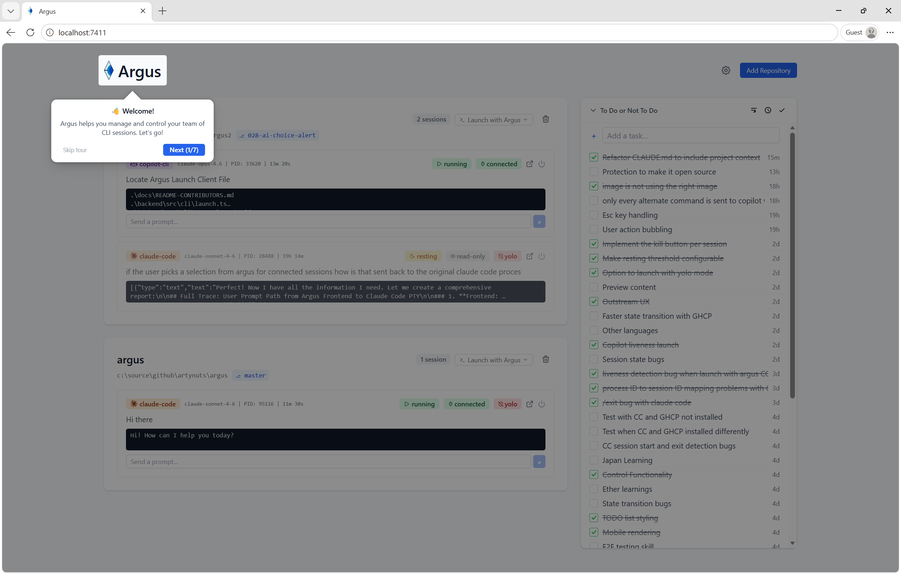

New to Argus? An interactive tour launches automatically on your first visit.Dismiss it any time and replay it later from Settings.

## Logging

All server logs include an ISO 8601 timestamp prefix. Log verbosity is controlled by the `LOG_LEVEL` environment variable, which applies to both the application logger and the HTTP request logger (Fastify/pino):

| `LOG_LEVEL` | What you see |
| ----------- | ------------ |
| `debug` | All logs including low-level diagnostics (scan timing, WS messages) |
| `info` | Normal operational logs: session lifecycle, PTY events, errors (default) |
| `warn` | Warnings and errors only |
| `error` | Errors only |
| `silent` | No logs |

```bash
LOG_LEVEL=debug node dist/server.js
```

## Storage

Argus keeps its data in `~/.argus/`:

| File                   | Purpose                                       |
| ---------------------- | --------------------------------------------- |
| `~/.argus/config.json` | Port, retention settings, watched directories |
| `~/.argus/argus.db`    | SQLite: repos, sessions, output               |

Default port: **7411**. Override in `~/.argus/config.json`:

```json
{
  "port": 7411,
  "sessionRetentionHours": 24
}
```

## Telemetry

Argus collects anonymous usage data to help improve the product. No personal information is ever sent.

**What is collected:**

| Event | When |
| ----- | ---- |
| `app_started` | Argus server starts |
| `session_started` | A new Claude Code or Copilot session is detected |
| `session_ended` | A session completes or ends |
| `session_prompt_sent` | A prompt is dispatched to a session via Argus |
| `session_stopped` | A session is stopped via Argus |
| `request_error` | An HTTP request to the Argus API returns a 4xx or 5xx error |

Each event includes: an anonymous installation ID (a random UUID stored in `~/.argus/telemetry-id`), the Argus version, and a timestamp. No file paths, prompts, session content, or user-identifying information are included. The `request_error` event additionally includes a sanitized error message (file paths and IDs stripped), the HTTP status code, and the origin function name.

**How to disable:**

- On first launch, a banner appears with a checkbox. Uncheck "Send telemetry" before clicking "Got it".
- At any time, open Settings (gear icon) and uncheck "Send anonymous usage telemetry" under the Privacy section.

## For Contributors

See [docs/README-CONTRIBUTORS.md](docs/README-CONTRIBUTORS.md) for architecture, dev setup, API reference, security model, CI pipeline, and development guides.

## Uninstall and Cleanup

### Remove the package

If you installed Argus globally via npm:

```bash
npm uninstall -g argus-ai-hub
```

If you only ever ran Argus with `npx`, no persistent package is installed. You can optionally clear the npx cache:

```bash
npx clear-npx-cache
```

### Remove Argus data

Argus stores all its data under `~/.argus/`. To delete it completely:

```bash
rm -rf ~/.argus
```

This removes the SQLite database, config file, and telemetry ID. After this, a fresh run will start with default settings.
